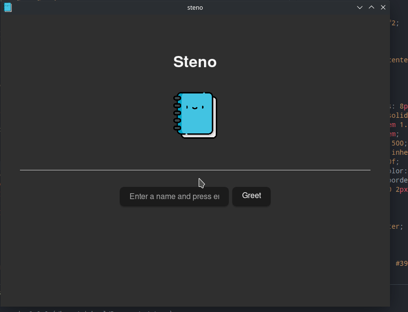

# ⌨️ steno

[](https://github.com/michaelwooley/steno/actions/workflows/test.yml) [](https://github.com/michaelwooley/steno/actions/workflows/release.yml)



# Development

Initial setup:

```bash
git clone git@github.com:michaelwooley/steno.git
cd steno

rustup target add wasm32-unknown-unknown
cargo install --locked trunk
cargo install wasm-bindgen-cli
```

To develop:

```bash
cargo tauri dev
```


## CI Notes

Based on:

- https://github.com/probablykasper/tauri-svelte-template
- https://github.com/Uninen/tauri-vue-template/tree/main/.github

https://tauri.app/v1/guides/faq#node-or-cargo

https://github.com/tauri-apps/tauri-action

## Recommended IDE Setup

[VS Code](https://code.visualstudio.com/) + [Tauri](https://marketplace.visualstudio.com/items?itemName=tauri-apps.tauri-vscode) + [rust-analyzer](https://marketplace.visualstudio.com/items?itemName=rust-lang.rust-analyzer).
